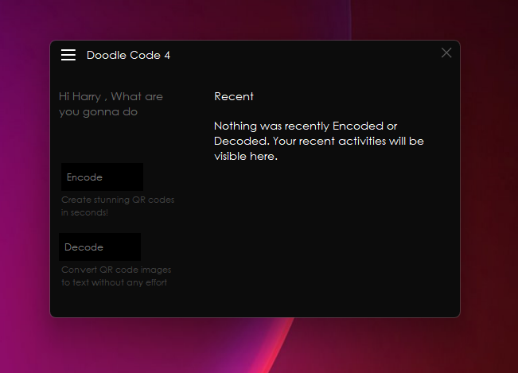
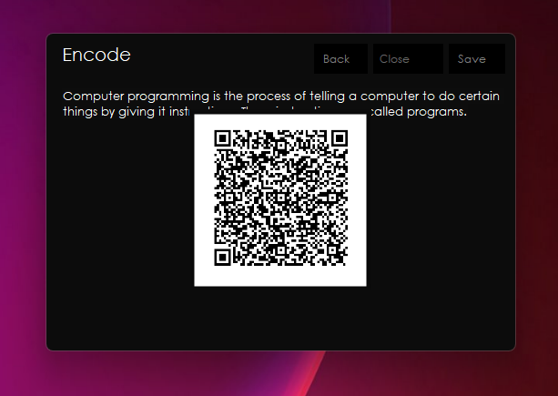
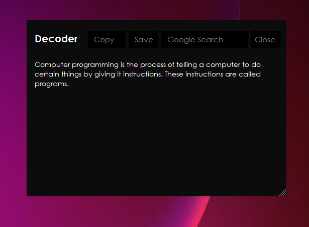

# Doodle Code
Create awesome Qr code in just one click! You can Both Encode and Decode Qr codes with the maximum accuracy.

# Usage

## Encoding
To encode QR code you just need to enter the text and click enter. And your Qr code will be visible to youYou can save and print the Qr code you created. 

## Decoding
To decode Qr code you don't need any scanner or camera, you just need to upload 
the image. It supports .png as well as .jpg and some more! If you want you can also add any other formats.

# Get DoodleCode

[Download](https://github.com/Harry260/Doodle-Code/releases/tag/DoodleCode)

## Additional Features

* Print and preview
* Output in two formats (.png/.jpg)
* Search with google with the decoded string
* Save as .txt(Plain text) | Decoded string
